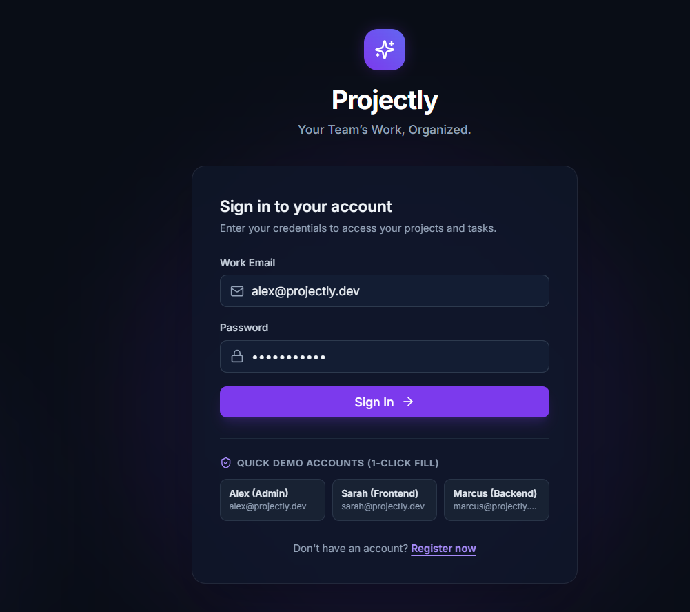
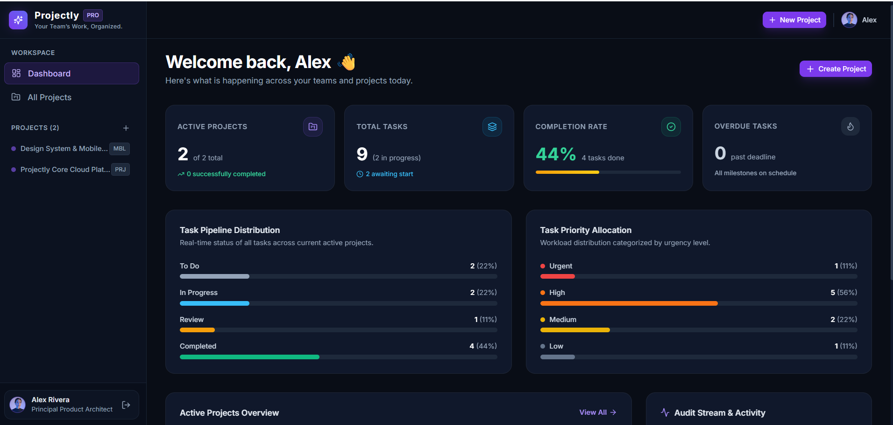
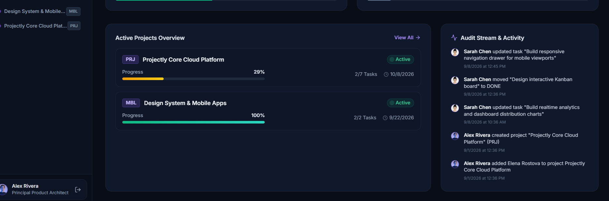
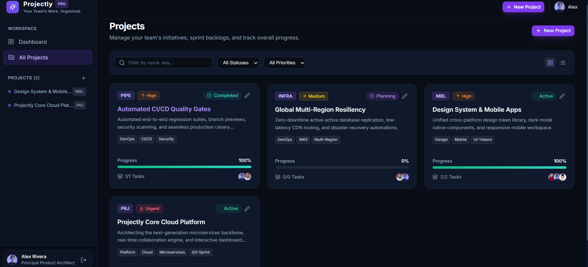
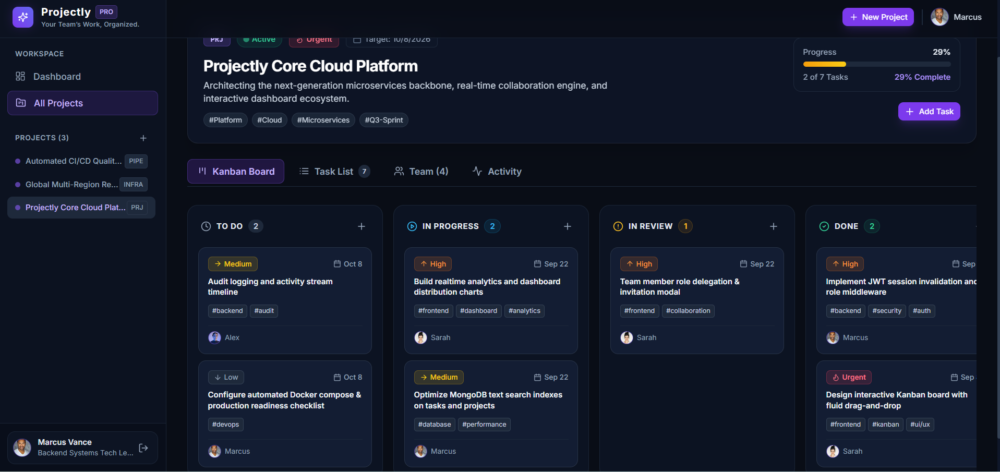
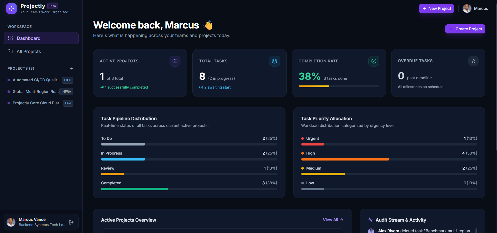

# Projectly — Your Team’s Work, Organized.

Projectly is a production-ready, full-stack team project management and productivity platform designed to help teams plan projects, manage tasks via interactive Kanban boards, collaborate with team members, and track real-time progress from a unified workspace.

- **Live Web Application**: [https://projectly-client.vercel.app/](https://projectly-client.vercel.app/)
- **Live Backend API**: [https://projectly-api-ga1h.onrender.com/](https://projectly-api-ga1h.onrender.com/)
- **API Health Check**: [https://projectly-api-ga1h.onrender.com/api/health](https://projectly-api-ga1h.onrender.com/api/health)

---

## Application Walkthrough & Screenshots

### 1. Authentication & 1-Click Demo Logins
Secure authentication portal featuring one-click demo credentials for rapid testing across Administrator, Frontend Lead, and Backend Lead roles.



---

### 2. Executive Dashboard & Real-Time Analytics
Aggregated database metrics displaying active initiatives, task pipeline distribution (To Do, In Progress, Review, Done), workload priority allocation, and completion percentages.



---

### 3. Active Projects & Audit Activity Stream
Live project progress bars with milestone deadlines and a real-time audit log tracking team actions, task movements, and collaborator updates.



---

### 4. Project Management Directory
Comprehensive project catalog supporting instant text search, multi-condition status and priority filtering, and dual Grid/Table view modes.



---

### 5. Interactive Kanban Board
4-column fluid drag-and-drop board (To Do, In Progress, Review, Done) with optimistic UI updates and instant database persistence.



---

### 6. Role-Based Personalized Workspace
Personalized workspace view demonstrating role-based access control, task assignments, and permission-aware project operations.



---

## Live Deployment Links

| Resource | URL | Status |
| :--- | :--- | :--- |
| **Production Frontend (Vercel)** | [https://projectly-client.vercel.app/](https://projectly-client.vercel.app/) | Active |
| **Production Backend (Render)** | [https://projectly-api-ga1h.onrender.com/](https://projectly-api-ga1h.onrender.com/) | Active |
| **API Health Status** | [https://projectly-api-ga1h.onrender.com/api/health](https://projectly-api-ga1h.onrender.com/api/health) | Online |

---

## Demo Accounts

All seeded demo accounts share the password: `password123`

| Name | Email | Role | Department |
| :--- | :--- | :--- | :--- |
| Alex Rivera | alex@projectly.dev | ADMIN | Core Product |
| Sarah Chen | sarah@projectly.dev | MEMBER | Frontend Engineering |
| Marcus Vance | marcus@projectly.dev | MEMBER | Infrastructure |
| Elena Rostova | elena@projectly.dev | MEMBER | Design System |

*(The login screen also provides 1-Click Demo buttons to automatically populate credentials.)*

---

## Core Features

- **User Authentication & RBAC**: JWT session authorization with bcrypt password hashing and tiered permissions (Owner, Admin, Member).
- **Project Management**: Full project lifecycle management (Create, Read, Update, Archive, Delete) with status tracking, priority flags, budget, and dates.
- **Task Management**: Comprehensive task CRUD with priorities (Low, Medium, High, Urgent), due dates, labels, assignees, and descriptions.
- **Interactive Kanban Board**: 4-column drag-and-drop board (To Do, In Progress, Review, Done) with optimistic UI caching and database persistence.
- **Project Progress Tracking**: Live calculated completion percentages based on task workflow statuses.
- **Dashboard Analytics**: Executive metrics showing project counts, task distributions, upcoming deadlines, and team workload.
- **Team Collaboration & Member Management**: Searchable member directory, project member invitations, and role delegations.
- **Task Commenting**: Real-time collaborative comment streams with author timestamps and delete privileges.
- **Activity & Audit Logging**: Automatic project-level event stream tracking status transitions, task creations, and member changes.
- **Search & Filtering**: Multi-condition filtering across projects and tasks by text query, priority, and lifecycle state.
- **Responsive Modern UI**: Built with React, Tailwind CSS, and Lucide icons, styled for clean desktop, tablet, and mobile workflows.

---

## Tech Stack

### Frontend
- **Framework**: React 18
- **Language**: TypeScript
- **Build Tool**: Vite 6
- **Styling**: Tailwind CSS, PostCSS, Autoprefixer
- **State & Data Fetching**: TanStack Query (React Query v5), Axios
- **Routing**: React Router DOM v6
- **Icons**: Lucide React
- **Hosting**: Vercel

### Backend
- **Runtime**: Node.js
- **Framework**: Express.js
- **Language**: TypeScript
- **Database**: MongoDB Atlas with Mongoose ODM
- **Authentication**: JSON Web Tokens (JWT) & bcryptjs
- **Validation**: Zod schema validation
- **CORS**: cors middleware
- **Hosting**: Render

---

## System Architecture

```text
[ React Client (Vercel) ]
  https://projectly-client.vercel.app/
                │
         HTTPS / REST API (Axios + TanStack Query)
                │
                ▼
[ Express Server (Render) ]
  https://projectly-api-ga1h.onrender.com/
   ├── Authentication Guard (JWT Verification)
   ├── Request Validation (Zod Schemas)
   ├── Controllers (Business Logic)
   └── Services (Data Transformation & Audit Logging)
                │
         Mongoose ODM Queries (TLS/SSL)
                │
                ▼
[ MongoDB Atlas Managed Database ]
   ├── Users Collection
   ├── Projects Collection
   ├── Tasks Collection
   ├── Comments Collection
   └── Activities Collection
```

---

## Project Structure

```text
Projectly/
├── .env.example
├── .gitignore
├── package.json
├── package-lock.json
├── README.md
├── Screenshots/
│   ├── image1.png
│   ├── image2.png
│   ├── image3.png
│   ├── image4.png
│   ├── image5.png
│   └── image6.png
├── client/
│   ├── index.html
│   ├── package.json
│   ├── postcss.config.js
│   ├── tailwind.config.js
│   ├── tsconfig.json
│   ├── tsconfig.node.json
│   ├── vercel.json
│   ├── vite.config.ts
│   └── src/
│       ├── App.tsx
│       ├── index.css
│       ├── main.tsx
│       ├── api/
│       ├── components/
│       ├── context/
│       ├── pages/
│       └── types/
└── server/
    ├── package.json
    ├── tsconfig.json
    ├── .env.example
    └── src/
        ├── app.ts
        ├── server.ts
        ├── config/
        ├── controllers/
        ├── middleware/
        ├── models/
        ├── routes/
        ├── scripts/
        ├── services/
        └── utils/
```

---

## Local Installation & Setup

### Prerequisites
- Node.js (v18+)
- npm (v9+)
- MongoDB (local service or MongoDB Atlas URI)

### 1. Clone the Repository
```bash
git clone https://github.com/viveknair6915/Projectly.git
cd Projectly
```

### 2. Install Dependencies
```bash
npm run install:all
```

### 3. Configure Environment Variables
Copy `.env.example` to `server/.env`:
```bash
cp server/.env.example server/.env
```

Ensure the configuration matches your local environment:
```env
PORT=5000
NODE_ENV=development
CLIENT_URL=http://localhost:5173
MONGODB_URI=mongodb://127.0.0.1:27017/projectly_pm
JWT_SECRET=super_secret_jwt_projectly_platform_key_2026_production
JWT_EXPIRES_IN=7d
```

### 4. Database Seeding
Initialize sample accounts, projects, tasks, comments, and activities:
```bash
npm run seed
```

### 5. Start Development Servers
Run both backend and frontend concurrently:
```bash
npm run dev
```

- Client Application: http://localhost:5173
- Backend REST API: http://localhost:5000
- API Health Status: http://localhost:5000/api/health

---

## Production Build

To verify and compile both client and server for production deployment:
```bash
npm run build
```
- Compiles backend TypeScript into `server/dist/`
- Bundles frontend assets into `client/dist/`

To launch the compiled server in production:
```bash
npm run start
```

---

## Deployment Configuration

### Backend (Render)
- **Root Directory**: `server`
- **Build Command**: `npm install && npm run build`
- **Start Command**: `npm run start`
- **Environment Variables**:
  - `NODE_ENV` = `production`
  - `PORT` = `5000`
  - `MONGODB_URI` = `<your-mongodb-atlas-connection-string>`
  - `JWT_SECRET` = `<your-jwt-secret>`
  - `JWT_EXPIRES_IN` = `7d`
  - `CLIENT_URL` = `https://projectly-client.vercel.app`

### Frontend (Vercel)
- **Root Directory**: `client`
- **Framework**: `Vite`
- **Build Command**: `npm run build`
- **Output Directory**: `dist`
- **Environment Variables**:
  - `VITE_API_URL` = `https://projectly-api-ga1h.onrender.com`

---

## Security Practices

- **Password Hashing**: Secure salted password encryption using `bcryptjs`.
- **JWT Authorization**: Bearer token authentication validated on protected endpoints via Express middleware.
- **Request Validation**: Incoming payloads strictly validated with Zod schemas.
- **Credential Protection**: Database connection strings and token secrets managed via environment variables and excluded from version control.
- **Resource Ownership**: Access control validation enforcing role permissions before mutation operations.

---

## License

This project is licensed under the MIT License.